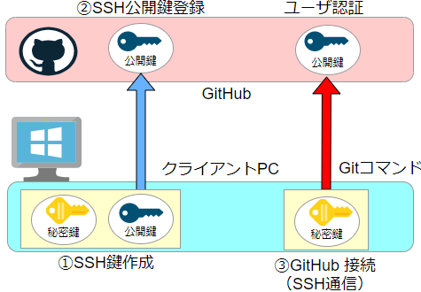
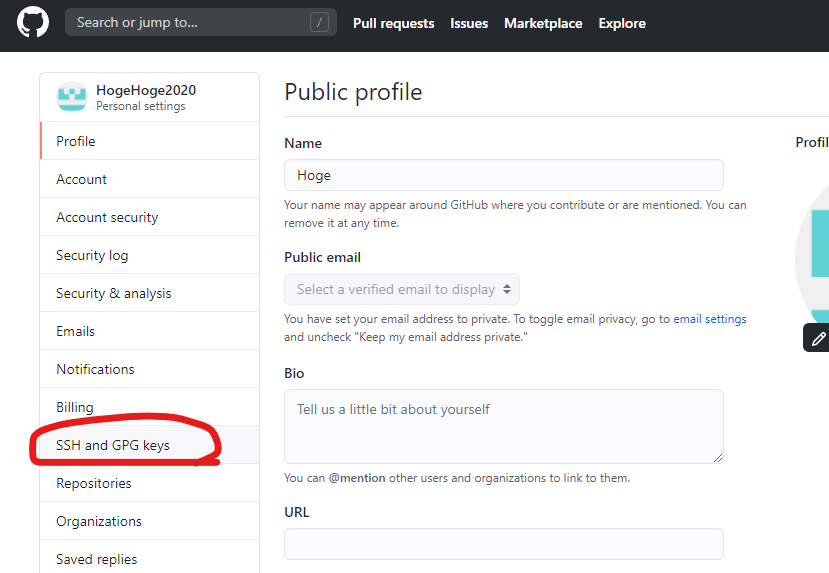
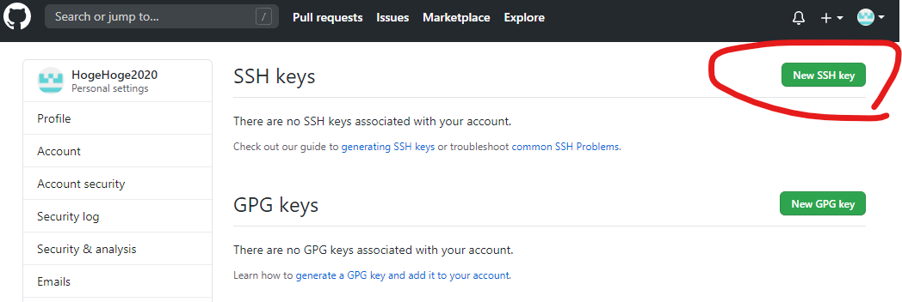
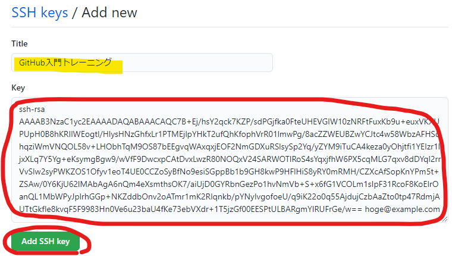
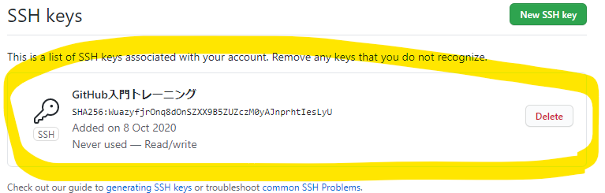

# GitHubリモート環境の設定

クライアント環境からGitHubをリモートで操作するための設定を行います。<br>
SSH通信を使用してGitHubにアクセスします。

#### GitHub SSH通信設定手続き



| # | 環境 | 項目                      | 内容           |
|---|------|---------------------|----------------|
| 1 | ローカル | SSH鍵を作成（秘密鍵、公開鍵）| GitHubに登録するための鍵を生成    |
| 2 | GitHub　| GitHubにログイン | 個人のGitHubアカウントを使用
| 3 | GitHub  | SSH鍵登録  | ローカルで作成した公開鍵を登録  |
| 4 | ローカル  | SSH鍵の設定  | GitHub通信で使用する鍵を指定  |

## :one: 【ローカル環境】SSH鍵を作成

 1. ✔️ ターミナルで、SSH鍵ファイル用のフォルダー（~/.ssh）をWindowsユーザフォルダー下に作成するコマンドを実行
``` bash
mkdir ~/.ssh
```

 2. ✔️ SSH鍵ファイル用のフォルダー（~/.ssh）に作成するコマンドを実行

``` bash
ssh-keygen -t rsa -b 4096 -f ~/.ssh/github.key
```

 3. ✔️ パスフレーズ入力と確認を求められるが、2回とも未入力で「エンターキー」をクリック
``` bash
Enter passphrase (empty for no passphrase):
Enter same passphrase again:
```

* SSH鍵作成の実行結果例
``` bash
$ ssh-keygen -t rsa -b 4096 -f ~/.ssh/github.key
Generating public/private rsa key pair.
Enter passphrase (empty for no passphrase):
Enter same passphrase again:
Your identification has been saved in /c/Users/User/.ssh/github.key
Your public key has been saved in /c/Users/User/.ssh/github.key.pub
The key fingerprint is:
SHA256:WuazyfjrOnq8dOnSZXX9B5ZUZczM0yAJnprhtIesLyU
The key's randomart image is:
+---[RSA 4096]----+
|          .....B*|
|         . ....o*|
|        o o  . o.|
|       + *  . = .|
|        S .. o ..|
|      E*.oo     o|
|     .++=o      .|
|     .**.+       |
|    .o+OX.       |
+----[SHA256]-----+
```

 4. ✔️ 作成されたSSH鍵作ファイルの確認
``` bash
ls ~/.ssh/
```

* SSH鍵確認の実行結果例
```bash
$ ls ~/.ssh/
github.key  github.key.pub
```
* SSH鍵ファイル
> github.key は、SSH秘密鍵<br>
> github.key.pub は、SSH公開鍵

 5. ✔️ GitHubに登録する公開鍵ファイル内テキストを表示
``` bash
cat ~/.ssh/github.key.pub
```

* 公開鍵ファイルテキスト表示例
```bash
$ cat ~/.ssh/github.key.pub
ssh-rsa AAAAB3NzaC1yc2EAAAADAQABAAACAQC7B+Ej/hsY2qck7KZP/sdPGjfka0FteUHEVGIW10zNRFtFuxKb9u+euxVKXUPUpH0B8hKRIIWEogtl/HlysHNzGhfxLr1PTMEjlpYHkT2ufQhKfophVrR01lmwPg/8acZZWEUBZwYCJtc4w58WbzAFHSqhqziWmVNQOL58v+LHObhTqM9OS87bEEgvqWAxqxjEOF2NmGDXuRSlsySp2Yq/yZYM9iTuCA4keza0yOhjtfi1YEIzr1ljxXLq7Y5Yg+eKsymgBgw9/wVfF9DwcxpCAtDvxLwzR80NOQxV24SARWOTlRoS4sYqxjfhW6PX5cqMLG7qxv8dDYql2rrVvSIw2syPWKZOS1Ofyv1eoT4UE0CCZoSyBfNo9esiSGppBb1b9GH8kwP9HFlHiS8yRY0mRMH/CZXcAfSopKnYPm5t+ZSAw/0Y6KjU62lMAbAgA6nQm4eXsmthsOK7/aiUjD0GYRbnGezPo1hvNmVb+S+x6fG1VCOLm1sIpF31RcoF8KoElrOanQL1MbWPyJplrhGGp+NKZddbOnv2oATmr1mK2RIqnkb/pYNXXXXXXXXXXXXXXXXXXXXXXXXXXXXXXXXXXXXXXXXXXXXXXXXXXXXXXXXXXXXXXXXXXX5jzGf00EESPtULBARgmYlRUFrGe/w==
```
* GitHubに登録する公開鍵
> 後ほど公開鍵のテキストをGitHubに登録します。


## :two: 【GitHub環境】GitHubにSSH公開鍵を登録

個人アカウントでGitHubにログインし、SSH公開鍵を登録します。

* ブラウザでGitHubのログイン画面に遷移します。<br>
<u><a href="https://github.com/">https://github.com/login</a></u>

#### SSH公開鍵登録
 1. ✔️ GitHubログイン画面<br>

<hr>
 2. ✔️ 右上のユーザ写真を右クリックし「Settings」クリック<br>

<hr>
 3. ✔️ 左メニュー「SSH and GPG keys」クリック<br>

<hr>
 4. ✔️ SSH keysの「New SSH key」クリック<br>

<hr>
 5. ✔️ タイトル「GitHub入門トレーニング」入力し、Keyに「公開鍵のテキスト全文」を入力し、「Add SSH Key」をクリック<br>

<hr>
SSH公開鍵の登録後の画面<br>


## :three: 【ローカル環境】GitHubアクセス時に使用するSSH設定

 1. ✔️ SSH接続時の設定ファイル(~/.ssh/config)を作成
```bash
touch ~/.ssh/config
```

 2. ✔️ SSH接続時の設定ファイル(~/.ssh/config)をVisual Studio Codeで開く
```bash
code ~/.ssh/config
```

* コマンド実行後、下記のエラーメッセージが表示される場合は、VisualStudioCodeを再起動してから再度、コマンドを実行してください。<br>

``` bash
bash: code: command not found
```


 3. ✔️ github.com に接続時に使用するSSH秘密鍵ファイルを指定し、ファイルを保存<br>
（今回は、「SSH over the HTTPS」にてGitHubに接続します）
```yaml hl_lines="2 3 4"
Host github.com
  HostName ssh.github.com
  User git
  Port 443
  IdentityFile ~/.ssh/github.key
```

> SSH接続時の秘密鍵のパス指定
  * HostName（SSH接続するドメイン）<br>
  * User（ユーザ名）<br>
  * Port（ポート） 443を指定することで「SSH over the HTTPS」で接続<br>
  * IdentityFile（SSH秘密鍵のパス）

### 【参考】Windowsでプロキシサーバーを使用している場合の指定方法
```yaml hl_lines="5 6"
Host github.com
  HostName ssh.github.com
  User git
  IdentityFile ~/.ssh/github.key
  Port 443
  ProxyCommand connect.exe -H プロキシサーバーアドレス:ポート %h %p
```
* プロキシサーバー指定
> HTTPSプロトコルを使用してプロキシサーバー経由で、GitHubに接続させます。
----

4. ✔️ github.com に SSH接続時に使用するSSH秘密鍵ファイルを指定

```bash
ssh -T git@github.com
```

 5. ✔️ github.com 接続登録確認「yes」入力
```bash
The authenticity of host 'github.com (13.114.40.48)' can't be established.
RSA key fingerprint is SHA256:nThbg6kXUpJWGl7E1IGOCspRomTxdCARLviKw6E5SY8.
Are you sure you want to continue connecting (yes/no/[fingerprint])? 
```

* SSH 接続成功時の表示例
```bash
The authenticity of host 'github.com (13.114.40.48)' can't be established.
RSA key fingerprint is SHA256:nThbg6kXUpJWGl7E1IGOCspRomTxdCARLviKw6E5SY8.
Are you sure you want to continue connecting (yes/no/[fingerprint])? yes
Warning: Permanently added 'github.com,13.114.40.48' (RSA) to the list of known hosts.        
Hi GitHub_UserName! You've successfully authenticated, but GitHub does not provide shell access. 
```
* 成功メッセージ
> You've successfully authenticated

## :four: 【ローカル環境】その他のGit設定

 1. ✔️ Gitクライアントのユーザ設定例（自分のメールアドレス、名前）

```bash
git config --global user.email "hoge@example.com"
git config --global user.name "Your Name"
```

:ballot_box_with_check: 自分のメールアドレスを指定
> hoge@example.com

:ballot_box_with_check: 自分の名前を指定
> Your Name

 2. ✔️ テキストファイルの改行コード変換設定

```bash
git config --global core.autoCRLF false
```

